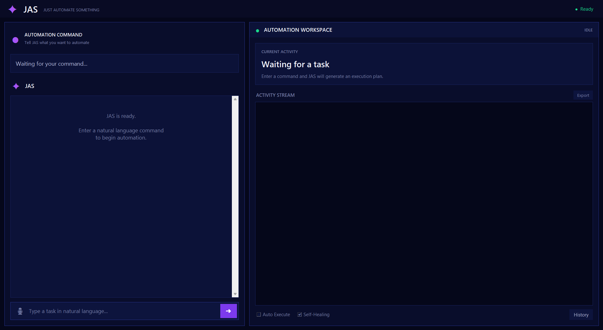

# ⚡ JAS — Just Automate Something

> A natural-language desktop automation agent that plans, executes, monitors, retries, and verifies tasks.

<p align="center">
  <b>Describe the task. Review the plan. Let JAS automate it.</b>
</p>

<p align="center">
  
  
  
  
  
  
</p>

---

## 📸 Dashboard Preview

<p align="center">
  
</p>


---

## 🔍 What is JAS?

**JAS — Just Automate Something** is an LLM-powered desktop automation agent that converts natural-language commands into structured action plans and executes them directly on the user's desktop.

Instead of manually writing automation scripts, the user simply describes a task:

```text
Open Notepad and type a haiku about rain
```

JAS then:

```text
Understands the request
        ↓
Generates an execution plan
        ↓
Displays the planned actions
        ↓
Requests user confirmation
        ↓
Executes each action
        ↓
Tracks execution progress
        ↓
Retries failed tasks with error context
        ↓
Captures the final screen
        ↓
Uses an LLM to verify task completion
```

No automation scripting is required.

Just describe the task.

---

## ✨ Features

| Feature | Description |
|---|---|
| 🧠 **LLM-Powered Planning** | Converts natural-language instructions into structured automation plans using Llama 3.1 8B |
| 🖥️ **Modern Desktop Dashboard** | Dark-themed graphical interface for commands, execution monitoring, logs, and automation status |
| ⚡ **Real-Time Execution** | Executes generated automation plans directly on the desktop |
| 📋 **Live Step Visualizer** | Displays every generated action and updates its execution state in real time |
| 🔁 **Self-Healing Execution** | Automatically generates a recovery plan when execution fails using the original plan and error context |
| 📸 **Screenshot Verification** | Captures the final desktop state and uses an LLM to evaluate whether the requested goal was achieved |
| 👤 **Human-in-the-Loop Control** | Requires confirmation before execution unless Auto Execute mode is enabled |
| 📜 **Persistent Command History** | Stores previous automation commands for quick reuse |
| 📝 **Activity Logging** | Maintains timestamped execution logs for debugging and analysis |
| 📁 **Log Export** | Allows automation session logs to be exported |
| 🔐 **Environment-Based Configuration** | Keeps API credentials outside the source code using `.env` configuration |

---

## 🎯 Why JAS?

Traditional desktop automation tools usually require:

- Scripts
- Hardcoded workflows
- Macros
- Fixed sequences of actions
- Programming knowledge

JAS explores a different approach.

The user specifies the **goal**, while the LLM determines the **sequence of actions** required to achieve it.

```text
Traditional Automation

User
 ↓
Writes Script
 ↓
Defines Every Action
 ↓
Executes Automation


JAS

User
 ↓
Describes Goal
 ↓
LLM Generates Plan
 ↓
JAS Executes Plan
 ↓
LLM Verifies Result
```

This project explores the integration of **Large Language Models, autonomous agents, desktop automation, execution monitoring, failure recovery, and visual verification**.

---

## ⚙️ How JAS Works

JAS uses a multi-stage automation pipeline.

### 1. Natural-Language Command

The user enters a task through the desktop interface.

```text
Open Calculator and calculate 256 * 32
```

### 2. LLM Planning

The command is sent to the language model.

The LLM converts the request into a structured JSON execution plan.

```json
{
  "steps": [
    {
      "action": "press",
      "key": "win"
    },
    {
      "action": "write",
      "text": "calculator"
    },
    {
      "action": "press",
      "key": "enter"
    }
  ]
}
```

### 3. Plan Visualization

Before execution, the generated steps are displayed in the JAS dashboard.

Each step can have one of several states:

```text
○ Pending
◉ Running
✓ Success
✕ Error
− Skipped
```

### 4. Human Confirmation

By default, JAS requests confirmation before executing the generated plan.

Users can optionally enable **Auto Execute** mode.

### 5. Desktop Execution

The executor processes each action sequentially using desktop automation controls.

### 6. Self-Healing

If execution fails, JAS sends the following information back to the LLM:

```text
Original User Command
+
Original Execution Plan
+
Failed Step
+
Execution Error
```

The LLM then generates a recovery plan.

JAS supports up to three execution attempts.

### 7. Screenshot Verification

After execution, JAS captures the final desktop state.

The screenshot and original user command are analyzed to determine whether the task was successfully completed.

---

## 🧠 System Architecture

```text
┌───────────────────────────────┐
│             USER              │
│                               │
│   Natural Language Command    │
└───────────────┬───────────────┘
                │
                ▼
┌───────────────────────────────┐
│          JAS DASHBOARD        │
│                               │
│   Command Input               │
│   Execution Plan              │
│   Activity Stream             │
│   Automation Status           │
└───────────────┬───────────────┘
                │
                ▼
┌───────────────────────────────┐
│          LLM PLANNER          │
│                               │
│   Understand User Intent      │
│   Generate Structured Plan    │
└───────────────┬───────────────┘
                │
                ▼
┌───────────────────────────────┐
│       AUTOMATION EXECUTOR     │
│                               │
│   Keyboard Actions            │
│   Mouse Actions               │
│   Waiting                     │
│   Screenshots                 │
└───────────────┬───────────────┘
                │
         ┌──────┴──────┐
         │             │
         ▼             ▼
┌────────────────┐  ┌────────────────┐
│    SUCCESS     │  │    FAILURE     │
│                │  │                │
│  Screenshot    │  │  Error Context │
│  Verification  │  │       ↓        │
│                │  │  Self-Healing  │
└────────────────┘  └────────────────┘
```

---

## 🎬 Example Workflow

### User Command

```text
Open Notepad and type Hello from JAS
```

### Generated Plan

```json
{
  "steps": [
    {
      "action": "press",
      "key": "win"
    },
    {
      "action": "write",
      "text": "notepad"
    },
    {
      "action": "wait",
      "seconds": 1
    },
    {
      "action": "press",
      "key": "enter"
    },
    {
      "action": "wait",
      "seconds": 2
    },
    {
      "action": "write",
      "text": "Hello from JAS"
    },
    {
      "action": "screenshot"
    }
  ]
}
```

### Execution Flow

```text
✓ Opening application
✓ Entering application name
✓ Waiting for application
✓ Launching application
✓ Waiting for window
✓ Typing requested text
✓ Capturing final screen
```

---

## 🎮 Supported Actions

| Action | Description | Example |
|---|---|---|
| `press` | Press a single keyboard key | `enter`, `win`, `escape` |
| `hotkey` | Execute a keyboard shortcut | `Ctrl + C`, `Alt + F4` |
| `write` | Type text using the keyboard | `"Hello World"` |
| `click` | Click specific screen coordinates | `(500, 300)` |
| `move` | Move the mouse cursor | `(800, 450)` |
| `scroll` | Scroll vertically | `3`, `-5` |
| `wait` | Pause execution | `2 seconds` |
| `screenshot` | Capture the current screen | Final-state verification |

---

## 💻 Technology Stack

| Technology | Purpose |
|---|---|
| **Python 3.11+** | Core application development |
| **Tkinter** | Desktop graphical interface |
| **PyAutoGUI** | Keyboard, mouse, and screenshot automation |
| **Llama 3.1 8B** | Natural-language understanding and execution planning |
| **Vision LLM** | Screenshot-based execution verification |
| **NVIDIA NIM** | LLM API inference |
| **Threading** | Background automation execution |
| **JSON** | Structured communication between the LLM and executor |
| **dotenv** | Secure environment configuration |

---

## 📁 Project Structure

```text
JAS/
│
├── main.py
│   └── Desktop dashboard and application controller
│
├── llm.py
│   └── LLM planning and execution verification
│
├── executor.py
│   └── Desktop action execution engine
│
├── logger.py
│   └── Session logging and log export
│
├── history.py
│   └── Persistent automation command history
│
├── prompt.txt
│   └── System instructions for the LLM planner
│
├── assets/
│   └── jas-dashboard.png
│
├── logs/
│   └── Generated automation session logs
│
├── .env.example
│   └── Environment configuration template
│
├── requirements.txt
├── LICENSE
└── README.md
```

---

## 🚀 Getting Started

### 1. Clone the Repository

```bash
git clone https://github.com/anishk-neuroforge/JAS.git
cd JAS
```

### 2. Create a Virtual Environment

```bash
python -m venv .venv
```

Activate the virtual environment.

#### Windows

```bash
.venv\Scripts\activate
```

#### Linux / macOS

```bash
source .venv/bin/activate
```

### 3. Install Dependencies

```bash
pip install -r requirements.txt
```

### 4. Configure the API Key

Create your `.env` file.

#### Windows

```bash
copy .env.example .env
```

#### Linux / macOS

```bash
cp .env.example .env
```

Add your NVIDIA API key:

```env
NVIDIA_API_KEY=your_api_key_here
```

### 5. Run JAS

```bash
python main.py
```

The JAS dashboard will launch.

Enter a natural-language automation command and start automating.

---

## 🔁 Self-Healing Execution

One of the core features of JAS is its ability to respond to execution failures.

A traditional automation script usually follows this pattern:

```text
Execute
   ↓
Failure
   ↓
Stop
```

JAS uses a recovery loop:

```text
Execute Plan
     ↓
Step Failure
     ↓
Collect Error Context
     ↓
Send Failure to LLM
     ↓
Generate Recovery Plan
     ↓
Execute Again
     ↓
Maximum 3 Attempts
```

The recovery context includes:

```json
{
  "failed_step": 3,
  "error": "Execution error information",
  "original_plan": {
    "steps": []
  }
}
```

This allows the model to generate a revised automation strategy instead of simply repeating the failed plan.

---

## 📸 Screenshot Verification

Completing an execution plan does not necessarily mean the user's goal was achieved.

JAS addresses this problem through post-execution verification.

```text
Automation Completed
        ↓
Capture Screenshot
        ↓
Send Screenshot + Original Goal
        ↓
Vision Model Analysis
        ↓
Success / Verification Note
```

This creates an additional feedback mechanism between execution and task completion.

---

## 🔐 Safety

Desktop automation software can directly interact with applications and user interfaces. JAS therefore includes several safety mechanisms.

- **Human-in-the-loop by default** — execution requires user confirmation.
- **Transparent planning** — generated actions are displayed before execution.
- **PyAutoGUI failsafe** — moving the cursor to the top-left corner can immediately interrupt automation.
- **Limited action space** — the executor only supports explicitly implemented automation actions.
- **Maximum retry limit** — self-healing execution is limited to prevent infinite retry loops.
- **Environment-based credentials** — API keys are not hardcoded into the application.

> JAS executes actions on your desktop. Always review generated plans before running automation involving important files, accounts, or applications.

---

## 🗺️ Roadmap

- [ ] Voice command input
- [ ] Real-time desktop preview
- [ ] Application-aware automation
- [ ] Improved visual grounding
- [ ] Multi-monitor support
- [ ] Macro recording and replay
- [ ] Custom automation plugins
- [ ] Local LLM support with Ollama
- [ ] Advanced execution memory
- [ ] Cross-platform automation support
- [ ] Configurable agent tools
- [ ] Workflow saving and sharing

---

## 📈 Future Vision

JAS currently demonstrates the core agent loop:

```text
Understand
    ↓
Plan
    ↓
Execute
    ↓
Observe
    ↓
Recover
    ↓
Verify
```

Future versions can expand this architecture toward more capable computer-use agents with:

- Visual understanding
- Application context
- Long-term execution memory
- Dynamic tool selection
- Multi-step reasoning
- Workflow learning
- Local model execution

The long-term objective is to explore how LLM-powered agents can interact with desktop environments through transparent, observable, and recoverable automation workflows.

---

## 📋 Changelog

### v2.0 — Dashboard Redesign

- Redesigned the JAS desktop dashboard
- Added modern dark-themed interface
- Added dedicated automation workspace
- Improved execution-plan visualization
- Added real-time activity status
- Improved automation status indicators
- Added compact command interface
- Improved history accessibility
- Improved activity-stream visualization
- Refined typography, spacing, and visual hierarchy

### v1.0 — Initial Release

- Natural language to structured action planning
- Llama 3.1 8B integration
- Desktop automation execution
- Live step visualizer
- Self-healing retries
- Screenshot verification
- Persistent command history
- Session logging
- Log export

---

## 🤝 Contributing

Contributions, ideas, and technical improvements are welcome.

If you plan to make a major change, open an issue first to discuss the proposed implementation.

Areas for contribution include:

- New automation actions
- GUI improvements
- Visual grounding
- Local LLM integration
- Cross-platform support
- Execution reliability
- Agent evaluation

---

## ⚠️ Disclaimer

JAS is an experimental and educational desktop automation project.

Generated automation plans may produce unexpected actions. Review execution plans carefully and avoid running untrusted commands in sensitive environments.

The project is intended for learning, experimentation, and research into LLM-powered desktop automation agents.

---

## 📄 License

This project is licensed under the MIT License.

---

## 👨‍💻 Author

**Anish K**

Building projects at the intersection of:

- Artificial Intelligence
- Machine Learning
- Autonomous Agents
- Desktop Automation
- Intelligent Systems

---

<p align="center">
  <b>⚡ JAS — Describe the task. Let the agent handle the steps.</b>
</p>

<p align="center">
  If you find the project interesting, consider giving the repository a ⭐
</p>